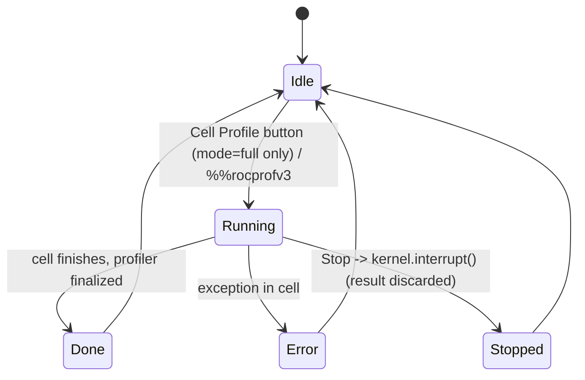

# jupyterlab-rocm Cell Profile

Cell Profile profiles a single PyTorch GPU notebook cell with `torch.profiler`
**inside the live kernel** (no subprocess). It has two modes that share one
process-wide profiler lock.

## Architecture (read this first)

- Only one `torch.profiler` can be active per process. Both modes acquire a
  single non-blocking lock `profiler_slot()` / `_PROFILER_LOCK`
  (`jupyterlab_rocm/profiler.py`). The loser of a race gets `ProfilerBusyError`
  -> an `error` job. No deadlock, no queue.
- Two processes, two threads:
  - **Full Cell** runs on the kernel **main execution thread** (the cell).
  - **Live capture** runs in a background **daemon thread** (`rocm-live-watcher`)
    started by `start_live_watcher` in `jupyterlab_rocm/magics.py`.
  - The **server extension** (`jupyterlab_rocm/handlers.py`) is a *separate
    process* from the kernel. They communicate only through files in
    `live_dir()` (`<cell_jobs_dir>/live/`): triggers, heartbeat, busy, disabled,
    stop.
- All live-capture signals are **strictly kernel-scoped** (keyed by
  `kernel_id`). There is no `any` fallback: a request without a `kernel_id` is
  dropped so it can never be claimed by another notebook's watcher.

## Mode 1: Full Cell (toolbar button / `%%rocprofv3`)

One-shot, synchronous. The cell runs to completion inside `torch.profiler`.
Stop = interrupt the kernel (`kernel.interrupt()`); the result is discarded.



- The toolbar button is **gated off when the sidebar mode is `live`**
  (`src/index.ts`, `CommandIDs.profileCell.isEnabled`) so a busy/long cell is
  not accidentally re-run.
- The inline result (`profileCellInline` in `src/index.ts`) shows a **Stop**
  button while the execution promise is pending; it calls
  `panel.sessionContext.session?.kernel?.interrupt()` and hides on completion.

## Mode 2: Live capture (sidebar)

For long-running cells. A background watcher samples the already-running cell
without re-running it. Two nested lifecycles: the **watcher** (Off/Ready) and a
**single capture window** (Capturing).

```mermaid
stateDiagram-v2
    [*] --> Off
    Off --> Ready: Enable live capture (%load_ext + clear disabled flag)
    Ready --> Off: Disable live capture (disarm)
    Ready --> Capturing: Profile now (write trigger)
    Capturing --> Ready: window elapsed (done)
    Capturing --> Ready: Stop and keep (early stop, keeps partial, stopped_early)
    Capturing --> Off: Disable (stops heartbeat; current window finishes then idle)
```



UI states (`src/components/Profiler.tsx`) are derived as
`Off / Ready / Capturing...` from `armed` (heartbeat freshness) and
`busy`/`pending`. When no kernel is selected, the panel shows "No kernel" and
disables the buttons.

### Disarm = pause flag, NOT killing the thread

The watcher thread is a daemon and lives for the kernel's life. Disarming writes
a `disabled-<kernel_id>` file; the watcher checks `live_disabled()` each loop and
skips heartbeat + trigger claims. Re-enabling deletes the flag. This avoids the
`%load_ext` no-op problem (IPython will not re-run `load_ipython_extension` on an
already-loaded extension, so the thread cannot be cleanly restarted).

### Early stop = interruptible wait, keeps partial

`profile_live_window(..., should_stop=...)` replaces `time.sleep(window_s)` with
`_interruptible_sleep`, polling `should_stop()` ~every 0.1s. On early stop it
still runs `prof.stop()` + `_finalize_torch_job`, marking
`job.extra["stopped_early"] = True`. The watcher passes
`should_stop=lambda: profiler.live_stop_requested(kernel_id)` and clears the
stop flag before and after each capture.

## API: `/jupyterlab-rocm/profile/cell/live`

`CellProfileLiveHandler` (`jupyterlab_rocm/handlers.py`). `kernel_id` is required
on POST (400 otherwise).

| Method | `action` | Effect |
|---|---|---|
| GET | - | `{armed, busy, disabled}` for the kernel |
| POST | `trigger` (default) | write a capture trigger (`window_s`, `warmup_s`, `options`) |
| POST | `stop` | `request_live_stop` -> end current window early, keep partial |
| POST | `disable` | `live_disable` -> disarm the watcher |
| POST | `enable` | `live_enable` -> re-arm a disarmed watcher |

Frontend wrappers: `liveProfile` / `liveStop` / `liveDisable` / `liveEnable` /
`liveStatus` in `src/handler.ts`.

## Key files

| File | Role |
|---|---|
| `jupyterlab_rocm/profiler.py` | `_PROFILER_LOCK`, `profile_cell_torch` (full), `profile_live_window` (live), live-dir file helpers (trigger/heartbeat/busy/disabled/stop) |
| `jupyterlab_rocm/magics.py` | `%%rocprofv3` magic; `_live_watcher_loop`, `_handle_live_trigger`, `start_live_watcher` |
| `jupyterlab_rocm/handlers.py` | `CellProfileLiveHandler` REST routes |
| `src/index.ts` | toolbar command, mode gating, inline result + Stop button |
| `src/components/Profiler.tsx` | sidebar Off/Ready/Capturing UI, Stop/Disable buttons |
| `src/handler.ts` | live API client functions |
| `src/cellProfileSettings.ts` | `cellProfileMode` + magic flag builder (mode does NOT affect the toolbar flags; the button is full-cell only) |

## Gotchas

- Job status enum: `queued -> running -> done | error` (`ProfileJob`). Live
  early-stop is still `done` with `extra.stopped_early = True`.
- `armed` is decided by the server reading heartbeat freshness (`max_age=6.0`).
  Disabling deletes the heartbeat so `armed` flips to False immediately.
- Python changes need a kernel/server restart to take effect; the watcher
  resumes via the pause flag without restarting the thread.

## Build / verify

The labextension is built **inside the container** (node lives there, not on the
host). Do not `pnpm install` on the host.

```bash
# Full base image (from dockerfiles/)
make base-rocm

# Frontend-only type/build check (from dockerfiles/, much faster)
docker build --target jupyterlab-rocm-builder -f Base/Dockerfile.rocm -t rocm-ext-check ..
```

Python tests: `pytest dockerfiles/Base/jupyterlab-rocm/tests`
(`test_profiler.py`, `test_magics.py`).
